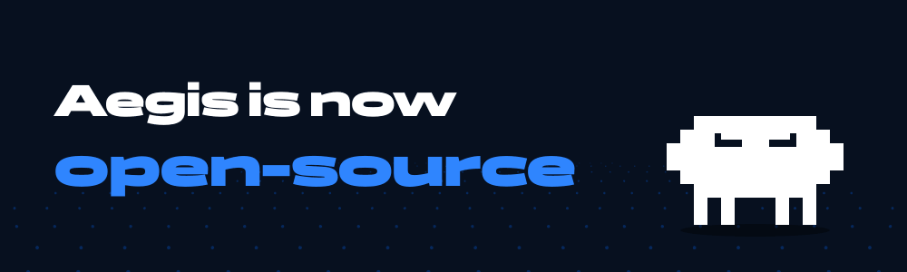

<p align="center">
  
</p>

<p align="center">
  One-command Discord moderation and community bot.<br>
  <a href="https://betterwithaegis.com">betterwithaegis.com</a> ·
  <a href="https://betterwithaegis.com/marka">Brand kit</a> ·
  License: AGPL-3.0
</p>

---

## What is Aegis?

One bot instead of twenty. Type `/setup` and the log channels, ticket panel and basic
protection thresholds are configured in about a minute. Everything is managed from
Discord or from the web panel.

## What is in this repository

The bot's core: the command and event handlers, AutoMod, logging, tickets with
translation, giveaways, polls, welcome and role panels, rules, anonymous confessions,
suggestions, music, server backups, the web panel and the translations.

## What is not in this repository

Some modules belong to the hosted Aegis service and are **not published in full**.
They are included as **previews only**: the first 50–100 lines of the file are real,
the rest is replaced by stub exports that do nothing. A header comment in each of
these files says how much is published.

This covers the anti-nuke and threat-detection engine, the AI features, and a few
community systems (levels, jury, parole, gate, buddy, sticky). In this build those
features are simply switched off; the rest of the bot works without them. Owner-only
operations tools, `.env` files and databases are also not part of the repository.

If you want those features, use the hosted bot.

## Setup

Requires Node.js 18+ and a Discord application.

```bash
git clone https://github.com/demirdenizgurkan75-cmd/Aegis.git
cd Aegis
npm install
cp .env.example .env     # fill in at least TOKEN and CLIENT_ID
npm run register         # register the slash commands with Discord
npm start
```

Most keys in `.env.example` are optional; the matching feature is disabled when a key
is missing.

## Configuration

- `.env` holds the token and keys. **Never commit it.**
- `AEGIS_OWNER_IDS` is a comma-separated list of the bot owners' Discord IDs.
- The database is kept as `database.json` at runtime and is not part of the repository.

## Contributing

Bug reports and small fixes are welcome as issues or pull requests. If you find a
security issue, please report it through
[betterwithaegis.com/bugbounty](https://betterwithaegis.com/bugbounty) instead of a
public issue.

## License

[GNU AGPL-3.0](./LICENSE). You may host and modify Aegis; if you offer a modified
version as a network service you must make its source available to its users.

The **Aegis™** name, the shield logo and the pixel mascot are trademarks and are not
covered by the AGPL. See [betterwithaegis.com/marka](https://betterwithaegis.com/marka)
for usage terms.
